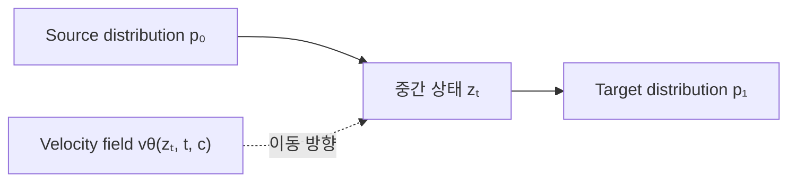

Flow matching에 대해 알아봅시다.

이 글에서는 flow matching을 너무 깊은 수학으로 들어가지 않고 설명합니다. 목표는 flow matching 논문을 처음 읽을 때 `source distribution`, `target distribution`, `probability path`, `vector field`, `interpolant`, `ODE solver`가 무엇을 뜻하는지 이해하는 것입니다.

특히 2D 지도 위의 궤적을 생성하면서 표준 Gaussian source 대신 직선 궤적과 같은 informative prior를 사용하는 연구를 읽을 수 있도록 설명합니다.

> 이 글은 수학적 증명보다 **논문 독해와 연구 적용**에 초점을 둡니다. 로보틱스, SLAM, VLN, 메모리, exploration 연구자가 flow matching을 자신의 문제에 어떻게 연결할 수 있는지를 중심으로 봅니다.
{: .prompt-info }



## Flow Matching의 핵심 아이디어

Flow matching은 **간단한 source distribution의 샘플을 target data distribution의 샘플로 이동시키는 속도장(vector field)을 학습하는 방법**입니다.

이미지 생성에서는 source가 Gaussian noise이고 target이 실제 이미지일 수 있습니다. 로봇 궤적 생성에서는 source가 무작위 궤적, 직선 궤적, 기존 planner의 궤적, 이전 planning cycle의 궤적일 수 있고, target은 expert demonstration이나 성공한 궤적일 수 있습니다.

Flow matching에서는 생성 과정을 보통 다음 ODE로 표현합니다.

$$
\frac{d z_t}{dt}=v_\theta(z_t,t,c), \qquad t\in[0,1]
$$

- $z_t$는 현재 생성 중인 샘플입니다.
- $t$는 생성 과정의 시간입니다.
- $c$는 조건입니다. 지도, 시작점, 목표점, 이미지, 언어 지시, 메모리 등이 들어갈 수 있습니다.
- $v_\theta$는 신경망이 예측하는 속도입니다.

$t=0$에서는 source sample이고, ODE를 따라가면 $t=1$에서 target과 비슷한 sample이 됩니다.

직관적으로는 각 위치에서 “어느 방향으로 얼마나 이동해야 하는가”를 알려 주는 바람장을 학습한다고 보면 됩니다.

---

### 핵심 용어

#### Source distribution

생성을 시작할 때 샘플을 뽑는 분포입니다. 보통 $p_0$라고 씁니다.

가장 흔한 source는 표준 Gaussian입니다. 하지만 반드시 Gaussian일 필요는 없습니다. 로보틱스에서는 다음과 같은 source를 생각할 수 있습니다.

- 시작점과 목표점을 잇는 직선 궤적
- A*, RRT*, MPC가 만든 초기 궤적
- 이전 planning cycle에서 사용한 궤적
- 과거 메모리에서 검색한 비슷한 궤적
- 간단한 behavior cloning 모델이 만든 궤적
- frontier 또는 information-gain 기반 exploration 궤적

#### Target distribution

최종적으로 모델이 생성하고 싶은 데이터 분포입니다. 보통 $p_1$이라고 씁니다.

예를 들면 충돌 없이 목표에 도달한 궤적, 사람의 demonstration, 성공한 grasp pose, VLN 데이터의 human route가 될 수 있습니다.

#### Probability path

Source distribution이 target distribution으로 변해 가는 중간 분포들의 모음입니다.

$$
p_0 \rightarrow p_t \rightarrow p_1
$$

여기서 중요한 것은 개별 샘플 하나만 이동하는 것이 아니라, 전체 분포가 시간에 따라 이동한다는 점입니다.

#### Vector field

현재 샘플을 어느 방향으로 이동시킬지 알려 주는 함수입니다.

$$
v_\theta(z_t,t,c)
$$

궤적을 생성하는 경우 입력과 출력이 모두 전체 궤적 크기를 가질 수 있습니다. 예를 들어 horizon이 $H$인 2D 궤적은

$$
\tau=[x_0,x_1,\ldots,x_{H-1}]\in\mathbb{R}^{H\times 2}
$$

로 표현할 수 있습니다. 이때 vector field도 $H\times 2$ 크기의 보정 방향을 출력합니다.

#### Flow map

초기 샘플을 시간 $t$의 샘플로 보내는 전체 변환입니다. 보통 $\phi_t$라고 씁니다.

Vector field가 순간적인 속도를 말한다면, flow map은 그 속도를 적분한 결과입니다.

---

### 궤적 연구에서 두 종류의 시간

Flow matching으로 궤적을 생성할 때 가장 자주 생기는 혼동입니다.

첫 번째는 **로봇의 물리적 시간 또는 waypoint index**입니다.

$$
\tau=[x_0,x_1,\ldots,x_{H-1}]
$$

여기서 $x_h$는 로봇이 실제로 움직일 때의 $h$번째 위치입니다.

두 번째는 **flow time**입니다.

$$
\tau_t,\qquad t\in[0,1]
$$

Flow time은 하나의 궤적 전체가 source trajectory에서 target trajectory로 바뀌는 생성 과정의 시간입니다.

따라서 $\tau_{0.3}$은 로봇이 전체 경로의 30%까지 이동했다는 뜻이 아닙니다. 아직 생성 중인 전체 궤적의 상태를 뜻합니다.

이를 간단히 쓰면 다음과 같습니다.

```plaintext
물리적 시간 h:   x0 ─ x1 ─ x2 ─ ... ─ xH-1
                   전체가 하나의 trajectory sample τ

flow time t:     τ0  ───────────────→  τ1
                 source trajectory      target-like trajectory
```

---

## Flow Matching은 어떻게 학습하는가

가장 단순한 설정을 보겠습니다.

Source sample을 $z_0$, target sample을 $z_1$이라고 하겠습니다. 두 샘플 사이를 직선으로 연결하면 중간 샘플은 다음과 같습니다.

$$
z_t=(1-t)z_0+t z_1
$$

이 경로의 속도는 매우 간단합니다.

$$
\frac{d z_t}{dt}=z_1-z_0
$$

따라서 모델은 다음 loss로 학습할 수 있습니다.

$$
\mathcal{L}_{FM}
=
\mathbb{E}\left[
\left\|v_\theta(z_t,t,c)-(z_1-z_0)\right\|^2
\right]
$$

학습 절차는 다음과 같습니다.

1. Target data $z_1$을 뽑습니다.
2. Source distribution에서 $z_0$을 뽑습니다.
3. $t\sim U(0,1)$을 뽑습니다.
4. $z_t=(1-t)z_0+t z_1$을 만듭니다.
5. 정답 속도 $z_1-z_0$를 계산합니다.
6. 신경망이 이 속도를 예측하도록 MSE로 학습합니다.

실제 flow matching의 핵심은 marginal vector field를 직접 계산하지 않아도, 이렇게 쉽게 계산되는 conditional velocity를 회귀하는 것으로 같은 최적해를 얻을 수 있다는 점입니다.

같은 $z_t$가 여러 source-target pair에서 만들어질 수 있습니다. MSE로 학습한 모델은 그 지점에서 가능한 속도들의 조건부 평균을 예측합니다. 이것이 개별 pair의 간단한 직선 속도를 이용해 전체 분포를 이동시키는 vector field를 학습할 수 있는 이유입니다.

---

### 생성할 때는 ODE를 적분합니다

학습이 끝나면 target sample은 필요하지 않습니다.

1. Source distribution에서 $z_0$을 뽑습니다.
2. 학습한 vector field를 따라 $t=0$에서 $t=1$까지 ODE를 적분합니다.

가장 단순한 Euler solver는 다음과 같습니다.

$$
z_{k+1}=z_k+\Delta t\,v_\theta(z_k,t_k,c)
$$

예를 들어 10-step generation이라면 $\Delta t=0.1$로 열 번 업데이트합니다.

Flow matching이 항상 one-step model인 것은 아닙니다. Vector field가 충분히 매끄럽고 생성 경로가 충분히 곧으면 적은 step으로도 잘 동작할 가능성이 높습니다. 반대로 경로가 복잡하거나 vector field가 급격히 변하면 더 많은 solver step이 필요합니다.

로보틱스에서는 Euler, midpoint, Heun, RK4 등을 비교할 수 있습니다. 같은 모델이라도 solver와 step 수에 따라 latency, 안정성, 충돌률이 달라질 수 있습니다.

---

### Diffusion과 Flow Matching의 차이

둘 다 간단한 분포를 복잡한 데이터 분포로 바꾸는 생성 모델입니다. 수학적으로도 밀접하게 연결되어 있습니다. 다만 학습 대상과 생성 관점이 다릅니다.

| 항목             | Diffusion                             | Flow matching                                             |
| ---------------- | ------------------------------------- | --------------------------------------------------------- |
| 주로 학습하는 값 | noise 또는 score                      | velocity field                                            |
| 기본 생성식      | reverse SDE 또는 probability-flow ODE | ODE                                                       |
| 흔한 source      | Gaussian noise                        | Gaussian이 흔하지만 일반화된 CFM에서는 다른 source도 가능 |
| 학습 직관        | noisy sample을 denoise                | sample을 이동시킬 속도를 회귀                             |
| 생성             | 반복 denoising                        | vector field 적분                                         |
| 안전성 보장      | 기본적으로 없음                       | 기본적으로 없음                                           |

Flow matching을 “diffusion보다 무조건 빠른 모델”로 이해하면 곤란합니다. 속도는 경로의 straightness, vector field의 smoothness, solver, step 수, 데이터 표현에 따라 달라집니다. 다만 velocity regression과 deterministic ODE라는 구조가 적은 step의 생성을 설계하기에 편리한 경우가 많습니다.

---

## 2D 지도 위 궤적 생성

> **Linear interpolant**와 **linear trajectory prior**는 이름은 비슷하지만 서로 다른 설계 요소입니다. 하나는 flow time의 경로를 정하고, 다른 하나는 생성의 시작 분포를 정합니다.
{: .prompt-warning }

이 부분이 2D trajectory 논문을 읽을 때 가장 중요합니다.

### Linear interpolant

Source sample과 target sample 사이의 **flow-time bridge**를 직선으로 정의하는 것입니다.

$$
z_t=(1-t)z_0+t z_1
$$

이는 학습 중간 샘플을 만드는 규칙입니다.

### Linear trajectory prior

Source distribution 자체를 시작점과 목표점을 잇는 직선 궤적으로 만드는 것입니다.

$$
\tau^{line}_h=(1-\lambda_h)s+\lambda_h g,
\qquad
\lambda_h=\frac{h}{H-1}
$$

이는 생성이 시작되는 초기 궤적의 형태입니다.

둘을 같이 사용할 수도 있고 따로 사용할 수도 있습니다.

```plaintext
source 설계:       Gaussian trajectory / straight-line trajectory / planner trajectory
interpolant 설계:  linear / Power3 / diffusion-like / stochastic bridge
```

Rectified flow에서 말하는 “linear trajectory”는 보통 flow time에서 source sample과 target sample을 직선으로 연결하는 것을 뜻합니다. 반면 “2D map에서 linear prior를 사용한다”는 표현은 보통 waypoint들이 시작점과 목표점을 직선으로 잇는 source trajectory를 뜻합니다.

첨부된 BRIDGER 논문도 이 둘을 별도의 설계 요소로 다룹니다. Source는 Gaussian, CVAE, heuristic policy 등으로 바꾸고, interpolant는 Linear 또는 Power3로 비교합니다.

---

### 수식으로 적어 보기

조건을 다음과 같이 두겠습니다.

$$
c=(M,s,g,l,m)
$$

- $M$: occupancy map, cost map 또는 semantic map
- $s$: 시작 위치
- $g$: 목표 위치
- $l$: 언어 지시가 있다면 instruction embedding
- $m$: 과거 memory 또는 retrieved episode

Target trajectory는 데이터에 있는 성공 궤적입니다.

$$
\tau_1\sim p_{data}(\tau\mid c)
$$

Source를 직선 prior로 만들면 다음과 같습니다.

$$
\tau_{0,h}=(1-\lambda_h)s+\lambda_h g+\epsilon_h
$$

여기서 $\epsilon_h$는 작은 perturbation입니다. 시작점과 목표점에는 perturbation을 넣지 않는 것이 일반적입니다.

$$
\epsilon_0=\epsilon_{H-1}=0
$$

그다음 flow-time 중간 궤적과 정답 velocity를 만듭니다.

$$
\tau_t=(1-t)\tau_0+t\tau_1
$$

$$
u_t=\tau_1-\tau_0
$$

모델은 지도와 시작점, 목표점 등의 조건을 보면서 다음을 예측합니다.

$$
v_\theta(\tau_t,t,M,s,g,l,m)
$$

학습 loss는 다음과 같습니다.

$$
\mathcal{L}
=
\mathbb{E}
\left[
\left\|
 v_\theta(\tau_t,t,c)-(\tau_1-\tau_0)
\right\|^2
\right]
$$

추론 시에는 line prior에서 시작해 ODE를 적분합니다.

```plaintext
직선 source trajectory
        ↓ vector-field update
장애물을 피하도록 휘어진 중간 trajectory
        ↓ vector-field update
데이터 분포와 비슷한 최종 trajectory
```

이 설정을 한 문장으로 해석하면 다음과 같습니다.

> 처음부터 경로 전체를 만들지 않고, 시작점과 목표점을 잇는 간단한 초기 경로를 데이터에서 본 좋은 경로로 보정하는 법을 학습합니다.
{: .prompt-tip }

---

### Line prior가 도움이 되는 이유

Gaussian trajectory는 시작점과 목표점, 전체적인 진행 방향, 속도 연속성에 대한 정보를 거의 포함하지 않습니다. 모델은 생성 초반부터 이 구조를 모두 만들어야 합니다.

반면 line prior는 최소한 다음 정보를 포함합니다.

- 시작점과 목표점
- 목표를 향하는 전체적인 방향
- waypoint의 대략적인 순서
- 비교적 작은 path length
- 기본적인 temporal consistency

따라서 모델은 “경로를 처음부터 만드는 문제”보다 “장애물과 선호를 반영해 경로를 수정하는 문제”를 풀게 됩니다. Source가 target에 가까우면 필요한 보정량이 작아지고, 적은 solver step이나 적은 데이터에서 유리할 가능성이 있습니다.

BRIDGER의 핵심도 비슷합니다. 이 논문은 Gaussian에서만 시작할 필요가 없으며, heuristic 또는 data-driven source policy처럼 더 informative한 source에서 시작하면 특히 diffusion step 수가 적을 때 성능이 좋아질 수 있다고 분석합니다.

다만 line prior가 항상 좋은 것은 아닙니다. 직선이 큰 장애물의 한가운데를 통과하거나, 실제 데이터가 여러 homotopy class를 갖는다면 line prior가 오히려 강한 편향이 될 수 있습니다.

---

### Diversity를 유지하는 방법

조건 $c$가 고정되어 있고 source가 항상 같은 직선이며 생성 ODE도 deterministic이라면, 출력도 항상 하나입니다.

따라서 여러 가능한 경로를 생성하려면 source에 randomness가 필요합니다. 다음 방법을 사용할 수 있습니다.

- 직선 주변에 smooth noise를 추가합니다.
- 중간 waypoint를 여러 개 샘플링합니다.
- 위쪽 우회, 아래쪽 우회 등 topological prior의 mixture를 사용합니다.
- A*, RRT*, PRM에서 여러 candidate를 뽑습니다.
- memory에서 여러 유사 궤적을 검색합니다.
- stochastic interpolant 또는 SDE sampling을 사용합니다.

단순한 independent Gaussian noise를 waypoint마다 넣으면 경로가 거칠어질 수 있습니다. Fourier basis, spline control point, Gaussian process처럼 시간적으로 상관된 perturbation을 쓰는 편이 자연스럽습니다.

---

### Linear path와 실제 ODE trajectory

학습할 때 각 source-target pair를 직선으로 연결하더라도, 여러 pair의 경로가 서로 교차할 수 있습니다. 한 지점에서 서로 다른 정답 속도가 관측되면 MSE 최적해는 그 속도들의 평균이 됩니다.

그 결과 실제로 학습된 marginal ODE trajectory는 휘거나 느려질 수 있습니다.

이 문제와 관련된 대표적인 방향은 다음과 같습니다.

- **Optimal Transport CFM**: source-target pairing을 더 좋은 coupling으로 만들어 path crossing을 줄입니다.
- **Rectified Flow**: 단순한 velocity regression으로 transport를 학습하고 coupling을 반복적으로 개선합니다.
- **Reflow**: pretrained model이 실제로 만든 source-target pair로 다시 학습해 경로를 더 곧게 만듭니다.

따라서 “linear interpolation을 사용했으니 one-step generation이 된다”는 결론은 자동으로 성립하지 않습니다. 실제로는 source-target coupling과 learned vector field의 smoothness를 확인해야 합니다.

2D map에서는 특히 장애물 때문에 서로 다른 homotopy class가 존재합니다. 위쪽으로 도는 경로와 아래쪽으로 도는 경로를 같은 위치에서 평균하면 장애물을 향하는 좋지 않은 방향이 나올 수 있습니다. 이 경우 topological class를 condition으로 주거나, class별 source mixture를 만들거나, 여러 candidate를 생성한 뒤 cost로 선택하는 방식이 필요합니다.

---

## Informative Source와 BRIDGER

BRIDGER는 source policy를 target expert policy로 refinement하는 stochastic interpolant 기반 방법입니다.

논문에서 source는 다음과 같이 구성됩니다.

- 표준 Gaussian
- CVAE로 학습한 data-driven policy
- task knowledge를 사용한 heuristic policy

결과는 informative source가 특히 적은 sampling step에서 유리하다는 방향을 보여 줍니다. 이 관점은 2D map trajectory 생성에도 그대로 적용할 수 있습니다.

- Gaussian source: 아무 구조가 없는 경로에서 시작합니다.
- Line source: 시작-목표 구조가 있는 경로에서 시작합니다.
- Planner source: collision과 topology 정보가 어느 정도 있는 경로에서 시작합니다.
- Retrieved source: 유사한 과거 경험에서 시작합니다.

BRIDGER는 interpolant 선택도 따로 비교합니다.

- Linear interpolant는 source에서 target으로 균일하게 진행해 학습이 비교적 안정적입니다.
- Power3 interpolant는 초반에 target 패턴을 빠르게 반영하고 후반에 미세 보정을 합니다.
- Highly multimodal한 grasp distribution에서는 Power3가 더 유리한 결과가 관찰됩니다.

또한 bridge 중간에 넣는 noise의 크기는 exploration과 coverage를 조절합니다. Source와 target의 차이가 크면 어느 정도 noise가 새로운 mode를 탐색하는 데 도움이 될 수 있지만, 너무 크면 분포가 과도하게 퍼집니다.

따라서 source prior, interpolant, noise schedule은 서로 다른 hyperparameter가 아니라 각각 별도의 모델 설계 요소로 보는 편이 좋습니다.

---

## 안전성과 동역학

Flow matching이 데이터 분포를 잘 학습한다고 해서 생성된 경로가 항상 충돌하지 않는 것은 아닙니다.

Line prior가 장애물을 통과하더라도 학습 데이터가 충분하면 모델이 우회 경로로 보정할 수 있습니다. 하지만 unseen obstacle, 큰 map shift, localization error가 있으면 실패할 수 있습니다.

실용적인 방법은 다음과 같습니다.

- 지도에서 signed distance field를 condition으로 제공합니다.
- collision penalty를 auxiliary loss로 추가합니다.
- 각 ODE step 뒤에 feasible set으로 projection합니다.
- 생성 후보를 collision checker와 path cost로 rerank합니다.
- Control Barrier Function 또는 safety filter를 vector field에 결합합니다.
- 최종 궤적을 MPC, CHOMP, TrajOpt 등의 optimizer로 짧게 보정합니다.
- receding-horizon 방식으로 자주 다시 생성합니다.

로봇의 동역학이 중요하면 position sequence만 생성한 뒤 inverse dynamics에 맡기는 방법보다, state-action trajectory를 생성하거나 dynamics residual을 loss에 포함하는 방법이 필요합니다.

---

## 로보틱스·SLAM·VLN·메모리·Exploration 응용

### Manipulation과 imitation learning

전체 action chunk를 하나의 sample로 두고 observation에 조건화할 수 있습니다.

$$
p(\tau_a\mid o)
$$

Source로 이전 action chunk의 마지막 action 주변, 간단한 controller output, grasp heuristic, 기존 policy output을 사용할 수 있습니다. 이 방식은 매 control cycle마다 Gaussian에서 시작하는 것보다 작은 수정으로 다음 action chunk를 만들 수 있습니다.

회전이나 pose를 다룰 때는 단순한 Euclidean interpolation이 부자연스러울 수 있습니다. $SO(3)$, $SE(3)$의 geometry를 반영한 Riemannian flow matching이 관련 방향입니다.

### Motion planning

Source를 classical planner의 warm start로 두고 target을 demonstration 또는 최적화된 trajectory로 둘 수 있습니다.

이때 flow model은 planner를 완전히 대체한다기보다, planner가 만든 거친 경로를 data-driven preference에 맞게 refinement하는 역할을 할 수 있습니다.

예를 들면 다음을 학습할 수 있습니다.

- clearance가 큰 경로
- 사람이 선호하는 이동 방식
- 특정 로봇의 kinodynamic 특성
- 좁은 통로에서의 자세 변화
- 여러 가능한 grasp approach

### Receding-horizon control

실행 중에는 새로운 관측이 계속 들어옵니다. 전체 경로를 한 번 생성하고 끝내는 것보다 짧은 horizon을 반복해서 생성하는 편이 안정적입니다.

Source로 직전 cycle의 남은 궤적을 shift해서 사용할 수 있습니다. 그러면 모델은 매번 처음부터 생성하지 않고 새 관측에 맞춰 기존 계획을 수정합니다.

---

### SLAM

이 부분은 아직 응용 아이디어에 가깝지만, flow matching의 source-refinement 관점과 잘 맞습니다.

### Odometry trajectory refinement

- Source: visual odometry 또는 wheel odometry가 만든 pose trajectory
- Target: loop closure와 global optimization이 반영된 trajectory
- Condition: image feature, scan feature, uncertainty, loop candidate

Flow model은 local odometry trajectory를 global consistency가 높은 trajectory로 바꾸는 correction field를 학습할 수 있습니다.

### Pose hypothesis generation

- Source: particle filter의 proposal 또는 coarse relocalization 후보
- Target: posterior pose distribution
- Condition: current observation과 map

다만 pose가 $SE(2)$ 또는 $SE(3)$에 있으므로 angle과 rotation을 단순한 좌표처럼 선형 보간하면 문제가 생길 수 있습니다. Lie group 또는 Riemannian geometry를 반영해야 합니다.

### Map completion과 exploration coupling

현재 partial map에서 가능한 future trajectory나 frontier sequence를 생성하고, 실제 관측으로 계속 refinement할 수 있습니다. 여기서는 map uncertainty를 condition에 명시적으로 넣는 것이 중요합니다.

---

### VLN

VLN에서는 조건이 이미지와 언어, topological memory로 구성됩니다.

$$
c=(o_{1:k},\text{instruction},\text{topological map},\text{memory})
$$

가능한 설계는 다음과 같습니다.

- Source: topological shortest path
- Target: human demonstration route
- Flow condition: instruction embedding과 visual features

이 모델은 shortest path를 그대로 따르는 것이 아니라, “소파를 지나 오른쪽 문으로 간다” 같은 언어 조건을 반영해 waypoint sequence를 수정할 수 있습니다.

또 다른 설계는 여러 source route를 준비하는 것입니다.

- geometric shortest path
- landmark를 많이 포함하는 path
- exploration을 포함하는 path
- memory retrieval path

Flow model이 이들을 instruction-conditioned target route로 refinement하도록 만들 수 있습니다.

FlowNav는 image-goal navigation과 exploration에서 conditional flow matching을 사용하고 depth prior를 결합한 사례입니다. VLN에서는 depth prior 대신 language grounding, semantic memory, topological relation을 condition으로 확장할 수 있습니다.

---

### 메모리

Flow matching은 retrieval과 generation 사이의 중간 형태로 사용할 수 있습니다.

1. 현재 상황과 비슷한 과거 episode를 memory에서 검색합니다.
2. 검색한 trajectory를 source로 둡니다.
3. 현재 지도, 목표, 언어 지시를 condition으로 줍니다.
4. Flow model이 source를 현재 상황에 맞게 수정합니다.

이때 memory는 정답을 그대로 복사하는 저장소가 아니라 좋은 initialization을 제공하는 source distribution이 됩니다.

실험에서는 다음을 비교할 수 있습니다.

- Gaussian source
- straight-line source
- nearest-neighbor retrieved source
- learned retrieval source
- planner source와 retrieval source의 mixture

Memory retrieval이 잘못된 경우를 대비해 source quality score를 condition으로 주거나, source와 current condition의 mismatch가 클 때 noise scale을 키우는 방법도 생각할 수 있습니다.

---

### Exploration

Exploration에서는 target 하나만 도달하는 것보다 coverage와 information gain이 중요합니다.

Source로 다음을 사용할 수 있습니다.

- frontier-based planner trajectory
- information-gain greedy trajectory
- ergodic coverage controller trajectory
- random walk보다 구조화된 sweep pattern

Target은 성공한 exploration trajectory 또는 높은 coverage와 정보 획득을 가진 trajectory distribution이 됩니다.

Flow matching의 장점은 하나의 best path만 회귀하지 않고 여러 exploratory behavior의 분포를 모델링할 수 있다는 점입니다. 여러 candidate를 빠르게 생성한 뒤 예상 information gain, collision risk, energy cost로 선택할 수 있습니다.

Flow Matching Ergodic Coverage는 flow matching 관점으로 target spatial distribution을 잘 덮는 control trajectory를 만드는 방향을 제시합니다. 이 계열은 map exploration, active perception, surface inspection에 연결하기 좋습니다.

---

## 구현 체크리스트

### 데이터 표현

- Trajectory horizon $H$를 고정할지 정합니다.
- 좌표를 map 크기와 해상도에 맞게 normalize합니다.
- 시작점과 목표점을 hard constraint로 고정할지 정합니다.
- orientation과 velocity를 trajectory에 포함할지 정합니다.
- occupancy map, SDF, semantic map 중 무엇을 condition으로 쓸지 정합니다.

### Source prior

- Gaussian과 반드시 비교합니다.
- Exact line 하나만 쓰지 말고 stochastic line distribution도 비교합니다.
- Planner prior와 retrieval prior를 비교합니다.
- Source의 collision rate, path length, target과의 distance를 따로 측정합니다.

### 모델

- 1D U-Net, temporal Transformer, DiT 형태를 사용할 수 있습니다.
- Map은 CNN 또는 ViT로 인코딩하고 trajectory token과 결합할 수 있습니다.
- 시작점, 목표점, 언어, memory를 condition token으로 넣을 수 있습니다.

### Sampling

- Euler step 수를 1, 2, 5, 10, 20 등으로 비교합니다.
- Heun이나 RK4가 같은 NFE에서 더 안정적인지 확인합니다.
- 여러 candidate를 생성하고 rerank하는 설정을 평가합니다.
- Closed-loop replanning 주기를 측정합니다.

### 평가 지표

- Goal success rate
- Collision rate
- Path length 또는 SPL
- Minimum obstacle clearance
- Smoothness, curvature, acceleration, jerk
- Endpoint error
- Inference latency와 NFE
- 서로 다른 homotopy class의 coverage
- Candidate diversity
- Unseen map과 dynamic obstacle에서의 성능

### 필요한 ablation

- Gaussian source 대 line source
- Deterministic line 대 noisy line
- Line source 대 A*/RRT* source
- Source-target pairing 방식
- Linear interpolant 대 다른 interpolant
- Solver step 수
- Noise scale
- Candidate 수
- Memory 유무
- Language condition 유무

---

### 학습과 추론 의사 코드

```plaintext
for each batch:
    condition c = (map, start, goal, language, memory)
    target trajectory τ1 ~ dataset
    source trajectory τ0 ~ source_prior(c)

    t ~ Uniform(0, 1)
    τt = (1 - t) τ0 + t τ1
    target_velocity = τ1 - τ0

    predicted_velocity = model(τt, t, c)
    loss = MSE(predicted_velocity, target_velocity)
    update model
```

추론은 다음과 같습니다.

```plaintext
τ = sample from source_prior(c)

for k = 0 ... K-1:
    t = k / K
    τ = τ + (1 / K) * model(τ, t, c)
    optionally apply endpoint mask / safety projection

return τ
```

실제 구현에서는 timestep broadcasting, trajectory mask, condition encoder, solver, endpoint fixation이 추가됩니다.

---

## 논문을 읽을 때 확인할 질문

Flow matching 기반 궤적 논문을 읽을 때 다음 질문에 답할 수 있으면 전체 구조를 이해한 것입니다.

1. 한 sample은 point인가, action chunk인가, 전체 trajectory인가?
2. Condition에는 무엇이 들어가는가?
3. Source distribution $p_0$은 무엇인가?
4. Source가 condition에 따라 달라지는가?
5. Target distribution $p_1$은 어떤 데이터인가?
6. Source-target pair는 무작위로 짝지었는가, OT나 다른 coupling을 사용했는가?
7. Interpolant는 linear인가, diffusion-like인가, stochastic인가?
8. Network는 velocity, score, noise 중 무엇을 예측하는가?
9. Generation은 ODE인가 SDE인가?
10. Solver와 NFE는 얼마인가?
11. 시작점, 목표점, 충돌, 동역학을 어떻게 보장하는가?
12. Multimodality는 어떻게 유지하는가?
13. Source prior에 대한 ablation이 있는가?
14. Source가 잘못되었을 때 복구할 수 있는가?
15. Open-loop인가, receding-horizon closed-loop인가?

2D map에서 line prior를 쓰는 논문은 다음처럼 읽으면 됩니다.

> Line prior가 coarse plan을 제공하고, flow matching은 데이터에서 학습한 correction distribution을 따라 이 plan을 refinement한다.
{: .prompt-tip }

이 관점으로 보면 모델이 “경로를 생성한다”는 표현과 “기존 경로를 보정한다”는 표현이 동시에 성립합니다.

---

## 추천 논문 로드맵

아래 순서는 이론을 완전히 증명하기 위한 순서가 아니라, 로보틱스와 trajectory 논문을 읽기 위한 순서입니다.

### 1. Rezende와 Mohamed, Variational Inference with Normalizing Flows, ICML 2015

Normalizing flow가 간단한 분포를 invertible transformation으로 복잡한 분포로 바꾼다는 출발점입니다. Change of variables의 직관만 확인하면 됩니다.

### 2. Chen, Rubanova, Bettencourt, Duvenaud, Neural Ordinary Differential Equations, NeurIPS 2018

Residual network를 연속시간 ODE로 보는 관점과 continuous normalizing flow의 기반입니다. ODE solver가 neural network의 일부가 될 수 있다는 점을 보면 됩니다.

### 3. Song, Sohl-Dickstein, Kingma, Kumar, Ermon, Poole, Score-Based Generative Modeling through Stochastic Differential Equations, ICLR 2021

Diffusion을 continuous-time SDE로 정리하고, 같은 marginal을 갖는 probability-flow ODE를 제시합니다. Diffusion과 flow의 연결을 이해하는 데 중요합니다.

### 4. Lipman, Chen, Ben-Hamu, Nickel, Le, Flow Matching for Generative Modeling, ICLR 2023

가장 중요한 기본 논문입니다. Conditional probability path와 conditional vector field를 이용해 simulation-free하게 velocity를 학습하는 구조를 봐야 합니다. 처음 읽을 때는 theorem보다 training algorithm과 OT path를 먼저 보는 편이 좋습니다.

### 5. Liu, Gong, Liu, Flow Straight and Fast: Learning to Generate and Transfer Data with Rectified Flow, ICLR 2023

Linear interpolation, rectified flow, reflow, trajectory straightness와 빠른 sampling의 관계를 이해하는 논문입니다.

### 6. Albergo, Boffi, Vanden-Eijnden, Stochastic Interpolants: A Unifying Framework for Flows and Diffusions

두 arbitrary distribution 사이에 stochastic bridge를 만들고 deterministic flow와 stochastic diffusion을 함께 다루는 통합 관점입니다. BRIDGER를 읽으려면 특히 중요합니다.

### 7. Tong, Fatras, Malkin, Huguet, Zhang, Rector-Brooks, Wolf, Bengio, Improving and Generalizing Flow-Based Generative Models with Minibatch Optimal Transport, TMLR 2024

Source가 Gaussian일 필요가 없다는 점과 OT-CFM을 통한 coupling 개선을 명확하게 다룹니다. Informative source와 source-target pairing을 연구할 때 직접적으로 관련됩니다.

### 8. Chi, Feng, Du, Xu, Cousineau, Burchfiel, Song, Diffusion Policy, RSS 2023

로봇 action trajectory를 생성 모델로 다루는 대표적인 기준점입니다. Flow policy가 무엇을 바꾸려는지 이해하려면 먼저 diffusion policy의 action chunk, conditioning, receding horizon을 보는 것이 좋습니다.

### 9. Ye와 Gombolay, Efficient Trajectory Forecasting and Generation with Conditional Flow Matching, IROS 2024

전체 trajectory를 하나의 sample로 보고 flow matching으로 forecasting과 planning을 수행합니다. 2D planning에 가까운 예시를 찾는다면 직접적인 참고가 됩니다.

### 10. Chen, Lim, Lin, Chen, Soh, Don’t Start from Scratch: Behavioral Refinement via Interpolant-based Policy Diffusion, RSS 2024

첨부된 BRIDGER 논문입니다. Gaussian 대신 heuristic 또는 learned source policy를 사용할 수 있다는 점, source quality, interpolant, noise scale을 별도로 분석한다는 점을 보면 됩니다.

### 11. Braun, Jaquier, Rozo, Asfour, Riemannian Flow Matching Policy for Robot Motion Learning, IROS 2024

로봇 pose와 state의 geometry를 반영하는 flow policy입니다. $SO(3)$, $SE(3)$, manifold-valued trajectory를 다룰 때 참고하기 좋습니다.

### 12. Gode, Nayak, Oliveira, Krawez, Schmid, Burgard, FlowNav, IROS 2025

Visual navigation과 exploration에서 CFM을 사용하고 depth prior를 결합합니다. Navigation 연구자가 flow matching을 실제 policy로 사용하는 방식을 볼 수 있습니다.

### 13. Dai, Yang, Yu, Liu, Sadeghian, Haddadin, Hirche, SafeFlow, 2025

Standard flow matching에는 collision이나 state constraint 보장이 없다는 문제를 flow matching barrier function으로 다룹니다. Motion planning에서 test-time 안전성을 고려할 때 읽을 만합니다.

### 14. Jiang, Fang, Roy, Lozano-Pérez, Kaelbling, Ancha, Streaming Flow Policy, CoRL 2025

Pure noise 대신 last action 주변에서 시작하고, 생성 중인 action을 바로 실행하는 구조입니다. Informative source, receding horizon, latency를 함께 생각할 때 관련성이 높습니다.

### 15. Sun, Pinosky, Murphey, Flow Matching Ergodic Coverage, RSS 2025

Exploration과 coverage를 flow matching 관점으로 연결합니다. 정보 수집, active perception, area coverage 연구에 적합합니다.

---

## 정리

Flow matching은 source sample을 target data distribution으로 이동시키는 velocity field를 학습합니다.

궤적 생성에서는 전체 trajectory를 하나의 고차원 sample로 보면 됩니다. 이때 source는 Gaussian일 필요가 없습니다. 직선 경로, planner output, 이전 계획, memory retrieval 결과처럼 문제 구조를 이미 포함한 prior를 사용할 수 있습니다.

2D map에서 linear trajectory prior를 쓰는 방법은 “처음부터 경로를 생성하는 모델”이라기보다 “간단한 초기 경로를 좋은 경로 분포로 refinement하는 모델”로 이해하는 편이 정확합니다.

다만 informative prior가 안전성, diversity, 동역학을 자동으로 해결하지는 않습니다. Source의 randomness, topological multimodality, collision constraint, solver step, closed-loop replanning을 별도로 설계해야 합니다.

Flow matching 논문을 읽을 때는 다음 세 가지만 먼저 확인하면 됩니다.

1. 무엇을 source로 쓰는가.
2. Source와 target 사이의 path와 velocity를 어떻게 정의하는가.
3. 생성된 trajectory의 feasibility와 diversity를 어떻게 유지하는가.

이 세 가지를 확인하면 2D map trajectory generation, robot policy, navigation, memory-based planning, exploration 논문의 대부분을 같은 틀로 읽을 수 있습니다.

---

## 참고문헌

1. Danilo Rezende, Shakir Mohamed. *Variational Inference with Normalizing Flows*. ICML 2015.
2. Ricky T. Q. Chen, Yulia Rubanova, Jesse Bettencourt, David Duvenaud. *Neural Ordinary Differential Equations*. NeurIPS 2018.
3. Yang Song, Jascha Sohl-Dickstein, Diederik P. Kingma, Abhishek Kumar, Stefano Ermon, Ben Poole. *Score-Based Generative Modeling through Stochastic Differential Equations*. ICLR 2021.
4. Yaron Lipman, Ricky T. Q. Chen, Heli Ben-Hamu, Maximilian Nickel, Matt Le. *Flow Matching for Generative Modeling*. ICLR 2023.
5. Xingchao Liu, Chengyue Gong, Qiang Liu. *Flow Straight and Fast: Learning to Generate and Transfer Data with Rectified Flow*. ICLR 2023.
6. Michael S. Albergo, Nicholas M. Boffi, Eric Vanden-Eijnden. *Stochastic Interpolants: A Unifying Framework for Flows and Diffusions*. arXiv:2303.08797; JMLR.
7. Alexander Tong, Kilian Fatras, Nikolay Malkin, Guillaume Huguet, Yanlei Zhang, Jarrid Rector-Brooks, Guy Wolf, Yoshua Bengio. *Improving and Generalizing Flow-Based Generative Models with Minibatch Optimal Transport*. TMLR 2024.
8. Cheng Chi, Siyuan Feng, Yilun Du, Zhenjia Xu, Eric Cousineau, Benjamin C. M. Burchfiel, Shuran Song. *Diffusion Policy: Visuomotor Policy Learning via Action Diffusion*. RSS 2023.
9. Sean Ye, Matthew C. Gombolay. *Efficient Trajectory Forecasting and Generation with Conditional Flow Matching*. IROS 2024.
10. Kaiqi Chen, Eugene Lim, Kelvin Lin, Yiyang Chen, Harold Soh. *Don’t Start from Scratch: Behavioral Refinement via Interpolant-based Policy Diffusion*. RSS 2024.
11. Max Braun, Noémie Jaquier, Leonel Rozo, Tamim Asfour. *Riemannian Flow Matching Policy for Robot Motion Learning*. IROS 2024.
12. Samiran Gode, Abhijeet Nayak, Débora N. P. Oliveira, Michael Krawez, Cordelia Schmid, Wolfram Burgard. *FlowNav: Combining Flow Matching and Depth Priors for Efficient Navigation*. IROS 2025.
13. Xiaobing Dai, Zewen Yang, Dian Yu, Fangzhou Liu, Hamid Sadeghian, Sami Haddadin, Sandra Hirche. *SafeFlow: Safe Robot Motion Planning with Flow Matching via Control Barrier Functions*. arXiv:2504.08661.
14. Sunshine Jiang, Xiaolin Fang, Nicholas Roy, Tomás Lozano-Pérez, Leslie Pack Kaelbling, Siddharth Ancha. *Streaming Flow Policy*. CoRL 2025.
15. Max Muchen Sun, Allison Pinosky, Todd Murphey. *Flow Matching Ergodic Coverage*. RSS 2025.
