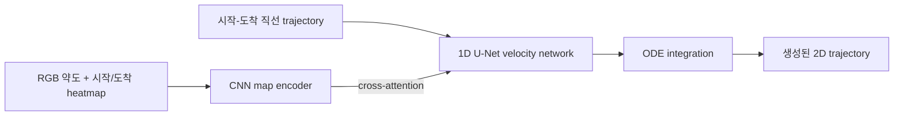

# Flow matcing에 대해 알아보자

*이 블로그는 https://www.youtube.com/watch?v=3mFNpeJQjmw 영상의 내용을 정리하고 2D 맵에 CFM으로 궤적을 생성 해보는 내용을 담고 있습니다

### flow matching 개요

flow matching에 대해서 알아보자

- 이게 대체 뭐길래 다들 하는건가?
- 이게 대체 디퓨젼하고 뭐가 다른가?

flow matching은 이미지 및 비디오 생성을 위한 최신 패러다임이다

Flow matching을 한 문장으로 설명하면 간단한 source distribution의 샘플을 target data distribution의 샘플로 이동시키는 속도장(vector field)을 학습하는 방법이라고 할 수 있다.

기존 디퓨젼 모델과 비교했을때 플로우매칭은 노이즈가 많은 프레임을 더 적은 단계 10~20 —> 2~3단계 수준으로 적은 단계로 잘 구성된 이미지로 정제한다

당장은 무슨 말인지 모르겠지만 이 글을 다 읽었을 때 당신도 flow matching에 대해 아는 사람이 될 수 있다!

이러한 flow matching이 어떻게 등장했고 어떤 알고리즘인지 알아보자

### 들어가며…

- 이미지는 픽셀로 이루어져 있으며 각 픽셀은 다차원 공간에서 독립적인 차원으로 볼 수 있다
- 하지만 인간으로서 우리는 픽셀강도를 두 축으로 나타내는 2D 시각화에 만족해야한다

<!-- 이미지 위치 01: image.png -->

여기서 파란색 구름은 확률 밀도를 나타낸다

밝은 영역일수록 의미있는 이미지가 포함될 가능성이 높고어두운 영역은 노이즈로 가득 차있다

이 밀도를 p_data라고 부르도록 하자. 왜냐면 이것은 데이터의 실제 (하지만 알려지지않은) 밀도를 반영하기 때문이다

생성형 모델링의 궁극적인 목표는 훈련 이미지 세트로부터  이 p_data를 학습하는 것이다

이렇게 하면 추론 시점에 학습 과정에서 보지 못한 새로운 모델을 생성할 수 있다

GAN (generative adversarial networks)과 같은 기존 모델들은 p_data를 ‘직접’ 학습하려고 시도했지만 출력 품질이 떨어졌다. 문제는 이것을 한 번에 학습하기가 매우 복잡하다는 것이다. 말 그대로 픽셀의 모든 가능한 조합에 대해 판단을 내려야하므로…

이 문제를 보다 쉽게 해결하기 위해 flow matching 및 diffusion과 같은 최신 방법은 p_data를 ‘점진적으로’ 찾아낸다. 프로그램적으로 선택된 훨씬 더 단순한 밀도 p_0으로 시작하여 시간이 지남에 따라 점진적으로 발전시켜 나간다

<!-- 동영상 위치 01: Screencast_from_2026-07-20_15-19-43.webm -->
[Screencast from 2026-07-20 15-19-43.webm](/assets/media/flow-matcing/Screencast_from_2026-07-20_15-19-43.webm)

생성 모델링은 t=0부터 t=1까지의 가상의 시간 간격 동안 작용한다

마치 진행 표시줄처럼 밀도 p_t를 소스 p_0와 대상 p_data 사이에서 이동시키는 역할을 한다

실제로는 p_data를 알 수 없으므로 훈련 데이터 주변에 확률 질량을 집중시키는 근사치를 사용하도록  모델을 유도한다. 이러한 점진적인 구축과정은 예술 작품을 점차적으로 빚어내는 것을 모방한 거라 할 수 있다. 

우리는 개별적인 획, 즉 중간 조형물 p_t가 매 짧은 시간 간격마다 어떻게 변화하는지를 모델링 하는 것을 목표로 한다

<!-- 이미지 위치 02: image 1.png -->

확률 질량도 유사하게 작용한다. 또한 적분값이 항상1이므로 보존량이다

<!-- 이미지 위치 03: image 2.png -->

P_t는 저절로 나타나거나 사라지지 않는다 대신 단순히 시간과 공간을 통해 이동할 뿐이다. 이러한 유형의 수송은 연속 방정식으로 설명된다

연속 방정식은 우리가 이전에는 어떻게 다뤄야 할지 몰랐던 편미분에 대한 표현식을 제공한다

<!-- 이미지 위치 04: image 3.png -->

이는 시간에 따라 밀도를 전달하는 시간 가변 velocity field v_t를 포함한다. 그렇다면 시간 가변 velocity field란 정확히 무엇일까?

우선 필드란 시간의 모든 시점에서 모든 위치에 정의되는 것이다. 특히 벡터 필드는 그러한 각 위치에 벡터 또는 화살표를 정의한다

일반적으로는 화살표 대신 이러한 유선을 사용하여 벡터장을 그린다.

<!-- 이미지 위치 05: image 4.png -->

벡터의 방향은 화살표로, 벡터의 크기는 색상으로 표시된다

<!-- 이미지 위치 06: image 5.png -->

이 영역에 입자를 떨어뜨리면 입자는 속도 흐름을 따라 움직이며, 보라색 영역에서는 속도가 느려지고 노란색 영역에서는 속도가 빨라진다

이 운동은 간단한 상미분 방정식(ODE)로 기술될수 있다.

<!-- 이미지 위치 07: image 6.png -->

이는 단순히 이동거리는 속도에 경과 시간을 곱한 값과 같다는 것을 의미하지만 이 공식을 극히 작은 시간 간격에 적용한 것이다 

특히 이 벡터 필드는 일정하지만 벡터 자체는 시간이 지남에 따라 방향과 크기가 모두 변할 수 있다

이제 우리가 이 필드 위에 입자 구름 전체를 떨어뜨린다고 상상해보자

연속방정식은 시간 당 밀도의 변화가 이 상미분 방정식에 따라, 즉 벡터필드에 의해 개별 입자가 어떻게 이동하는지에 따라 결정된다는 것을 알려준다

<!-- 이미지 위치 08: image 7.png -->

따라서 이 벡터 필드를 예측하도록 모델을 학습시키면 추론시점에 입자를 그 벡터필드를 통해 밀어 넣을 수 있다

P_0에서 샘플링한 지점 x_0에서 시작하여 시간에 따른 필드의 변화를 추적하고, 최종적으로는 잘 형성된 이미지일 가능성이 높은 목적지에 도달한다

<!-- 이미지 위치 09: image 8.png -->

 

이러한 벡터 필드를 학습하는 것이 flow기반 방법의 핵심 아이디어이다

### 역사 (?)

flow matching은 오늘날 가장 널리 알려진 기술이지만 그 역사는 10년 이상 전으로 거슬러 올라간다

Normalizing Flow는 2015년에, Continuous Normalizing Flow(CNF)는 2018년에 flow matching은 2023년에 발표되었다

<!-- 이미지 위치 10: image 9.png -->

2022년 이전에는 이미지 생성의 지배적인 패러다임이 GAN이었지만, 이후 Stable Diiffusion과 같은 디퓨젼 모델에 밀려났다

문제는 flow 기반 학습 방법이 학습에 사용할 명확한 정답 속도 필드가 없기 때문에 학습이 매우 어렵다는 것이었다..

<!-- 이미지 위치 11: image 10.png -->

학습 데이터 세트에 포함된 이미지는 최종 목적지를 보여주며, 과정(데이터로 가는 여정) 자체에 대한 정보는 제공하지 않는다

CNF모델은 계산 비용이 매우 많이 드는 간접 학습 목표를 사용했다. 그것은 단 한 번의 학습 단계에서 전체 역방향 여정을 시뮬레이션 했다. 학습샘플 x_1에서 시작하여 velocity field를 역방향으로 추적하여 노이즈가 포함된 지점 x_0까지 도달한다. 이러한 과정에서 모델이 x_1에 부여하는 확률을 평가하라는 등의..

학습 목표는 해당 데이터가 실제 데이터 포인트라는 것을 알고 있으므로 모델이 이 확률을 최대화 하도록 유도한다 

<!-- 이미지 위치 12: image 11.png -->

이것은 Maximum Likelihood Estimation, MLE 라고 알려져 있다

이 여정의 각각의 화살표 구간은 velocity field의 점 추정치를 얻기 위한 별도의 모델 호출이다

이것이 바로 학습 비용이 너무 많이 드는 이유였고, 그 결과 CNF모델은 GAN이나 디퓨젼 모델에 비해 확장성이 충분하지 못했다

플로우매칭은 이 과정을 획기적으로 단순화한다

이는 지도 학습 방식으로 속도 레이블을 생성하는 방법을 제시함으로써 이러한 왕복과정의 필요성을 없애준다

우리는 그 속도 레이블을 supervised labels: v*라고 부를것이다

이러한 요소들이 존재할 경우, 모델은 모델 예측값 v_theta와 레이블 v* 사이의 제곱거리를 최소화하는 더 간단한 목적함수를 사용하여 학습될 수 있다

<!-- 이미지 위치 13: image 12.png -->

이를 평균제곱오차(MSE)라고 한다

CNF와 비교했을 때, 이 학습 반복에는 모델 호출이 한 번만 필요하다. 따라서 훨씬 빠르며, 동일한 연산 예산으로 더 많은 데이터를 사용하여 더 큰 모델을 학습시킬 수 있다

### flow matching algorithm

먼저 플로우 매칭 알고리즘의 전체 과정을 설명 하겠다

다음은 플로우 매칭 알고리즘의 단일 학습 반복 과정이다

먼저 학습 데이터 세트에서 이미지 x_1을 선택한다. 소스 밀도에서 노이즈 샘플 x_0을 선택한다

이 두 끝점 사이를 직선으로 움직이는 입자를 생각해보자

이제 임의의 시점을 선택하고, 거기에서 입자의 속도를 계산한다.

일정한 속도로 움직인다고 가정하면, v*라는 표시는 x_1에서 x_0을 뺀 값으로 간단히 나타낼 수 있다

이제 이 고정점 x_t에서 모델을 호출하여 예측값 v_theta를 얻는다. 모델 예측값과 지도학습을 통해 얻은 레이블간의 평균 제곱 오차를 계산한다

<!-- 이미지 위치 14: image 13.png -->

그에 따라 모델 매개변수를 업데이트 한다.

이제 이 과정을 반복하여 시간에 따라 변하는 속도장을 학습하는 모델을 학습시킨다.

여기서 의문점이 들수 있드아…..

이 알고리즘에는 언뜻 보기에 임의적인 것처럼 보이는 요소들이 너무나 많다!

우선, x_1과 x_0는 서로 독립적으로 선택된다

이를 CNF와 비교해보면, CNF에서는 속도예측을 역으로 따라가서 x_0을 x_1로부터 도출했다

그렇다면 왜 그 둘 사이에 직선을 그어야할까?

실제 속도장에는 분명리 어느 정도 곡률이 존재한다

모델은 곡률을 어디에서 학습할까?

그리고 등속이라는 폭력적인 가정을 해도 되는 걸까?

실제 속도장은 시간에 따라 분명히 변화한다

그렇다면 모델은 시간의존성을 어디에서 학습할까?

전반적으로 flow matching은 학습에 있어 분할정복방식을 제안한다. 극복해야 할 가장 큰 문제는 p_0을 하나의 단일체 p_1으로 옮기는 것이다.

플로우 매칭은 이를 여러개의 간단한 작업으로 분해한다

각 학습 단계에서는 실제 이미지 x_1을 선택한 다음, p_0을 해당 이미지를 조건(목표)으로 하는 가우시안 분포로 변환한다

따라서 단 한 번의 학습 반복을 통해 모델은 p_0을 x1에 조건부로 부여된 밀도 p_1으로 변환하는 방법을 학습하게 된다

<!-- 이미지 위치 15: image 14.png -->

이러한 간단한 수송 과정을 시뮬레이션 하려면 해당 조건부 velocity field가 필요하다 

그냥 v_t대신에 x_1에 조건부로 적용된 v_t를 시뮬레이션할 것이며, 그 방법을 설명하겠다

단순한 p_0을 가우시안으로 변환하고 전송하는 방법만 학습하는 모델은 그다지 유용하지 않다. 목적지 x_1을 알아야만 그 목적지까지 이어지는 velocity field를 생성할 수 있다. 물론 추론 시점에는 x_1에 접근할 수 없다. 그러나 핵심은 그것을 생성하는 것이다

여기에 플로우 매칭의 비결이 있는데, 이러한 기본 작업에 대해 모델을 학습시키면 까다로운 p_0에서 p_1로의 전송을 수행하는 능력이 자동으로 나타날 수 있다

즉, 조건부 속도장을 관찰하는 모델은 무조건부 속도장(주변 속도장)을 암묵적으로 학습할 수 있다!

플로우매칭 알고리즘은 이러한 속성을 가지고 있음이 검증되었다

그런 공짜 서비스가 존재한다는 사실이 그다지 명확하지 않았고, 아마도 그것이 플로우 기반 방법론이 이러한 공식을 도출하는데 시간이 걸린 이유가 아닐까 싶다

조건부 필드와 marginal 필드 사이의 관계를 이해하려면 먼저 p_0를 가우시안 분포로 변환하고 학습 신호 역할을 하는 조건부 필드를 생성하는 방법을 알아내야 한다

우선 주목해야할 점은 이 필드가 유일무이한 것이 아니라는 사실이다

길은 곧게 뻗어 있거나, 아래로 굽어지거나, 심지어는 고리 모양으로 이어질 수도 있다

<!-- 이미지 위치 16: image 15.png -->

그러므로 우리는 이 중 하나를 선택하는 데 있어 원칙에 입각한 방법을 찾아야 한다.

수학적 최적화 분야에는 optimal transport라는 분과가 있는데, 이 분야는 다음과 같은 질문에 대한 답을 찾고자 한다

“밀도를 다른 밀도로 이동시키는 여러 방법 중에서 이동거리의 제곱을 최소화하는 방법은 무엇일까요?”

이는 효율성이라는 개념을 공식화하고 효율적인 속도장이 더 짧은 경로와 더 빠른 추론으로 이어진다는 점에서 문제를 접근하는 방식이다

그래서 우리는 최적 수송 이론을 사용하여 조건부 필드를 선택할 것이다

이 질문에 답하는 것은 일반적으로 매우 어렵다. 쉬웠다면 최적 수송법을 통해 p_0을 p_1로 직접 수송하는 방법을 알 수 있었을 것이다

하지만 가우스 분포의 경우에는 답이 간단하다. 최적의 전송 경로는 아핀 변환이다

이는 단순히 크기 조정 작업과 변환작업을 의미한다

<!-- 이미지 위치 17: image 16.png -->

따라서 밀도함수 p_0에서 샘플링된 모든 점 x_0은 시그마만큼 스케일링되고 x_1만큼 이동한다

하지만 이 지도는 끝점만 보여줄 뿐이다

하나의 밀도를 다른 밀도로 점진적으로 변형하기 위해 1997년에 발표된 결과를 활용할 수 있다. 이 결과에 따르면 하나의 가우시안 분포를 다른 가우시안 분포로 변형하는 최적의 방법은 x_0와 그 이미지 T(x_0) 사이를 ‘선형 보간’ 하는 것이다

<!-- 이미지 위치 18: image 17.png -->

이를 통해 조건부 경로상의 모든 중간 지점 x_t에 대한 표현식을 얻을 수 있다

실제로 이는 flow matching 알고리즘에서 표준 편차 시그마를 0으로 설정한 선형 보간법이다

<!-- 이미지 위치 19: image 18.png -->

이 값을 0으로 설정하는 것은 실제 모델에서 매우 흔한 관행이다 

0이 아닌 시그마 값은 이론 수학에서 온갖 예외적인 경우를 피하는 데 도움이 되지만 실제로는 아무런 차이를 만들지 않는다 

두 가우시안 분포 사이의 최적 전달 방식을 이해하고 나면, 학습 알고리즘의 처음 세 단계가 이제 이해될 것이다

x_1은 목표 조건부 분포의 평균이다

하나의 x_0값을 샘플링하고 x_1까지 직선을 그리는 것은 이 음영처리된 원뿔에서 수송샘플을 추출하는 한가지 방법이다

<!-- 이미지 위치 20: image 19.png -->

직선을 그리는 것은 더 이상 임의적인 결정이 아니다

이는 임의의 두 지점 사이가 아니라 두 가우시안 강도 사이에서 최적의 전송을 구현하는 방법이다

속도는 거리/시간, 즉 dx/dt 이므로 계산은 x_1-x_0으로 간단해진다

<!-- 이미지 위치 21: image 20.png -->

그러나 이것만으로는 여전히 만족스럽지 않다

수학적으로는 맞더라도, 일정한 속도라는 표시는 시간에 따라 변하는 속도장 v_t를 학습하려는 우리의 궁극적인 목표와 여전히 상충되는 것처럼 보인다

그렇다면 이러한 괴리는 어디에서 오는걸까?

v*는 조건부 필드 전체를 대표하는 것은 아니다

우리는 최적의 이동경로를 따라, 그리고 입자가 존재할 가능성이 높은 시간대에, 시공간적으로 매우 제한적인 영역에서 이를 평가한다 

하지만 완전한 조건부 속도장은 전체 시공간을 아우른다

여기에는 입자가 절대 도달하지 않는 이 모서리가 포함되며 입자가 더 이상 존재하지 않는 시간 t=1에서의 이 위치도 포함 된다

<!-- 이미지 위치 22: image 21.png -->

<!-- 이미지 위치 23: image 22.png -->

이 더 큰 속도장은 실제로 시간에 따라 변한다

벡터의 방향은 변하지 않지만, 크기는 변한다

시간이 흐를 수록 필드는 점점 더 노란색으로 뒤덮인다 (노란색 : high)

입자가 목적지에 도달하는 데 남은 시간이 적을수록 속도장은 훨씬 더 강하게 밀어붙여야한다

실제로 t가 1이 되는 순간, 즉 시간이 완전히 소진되면 크기는 무한대로 폭발한다

하지만 우리는 최적경로를 따라 이 속도장을 평가하기로 했다

만약 우리가 하나의 입자를 추적한다면, 그 입자가 장의 크기 변화에 맞춰 움직이는 것을 볼수 있을 것이다.그 관점에서 보면 속도는 일정하다

하지만 완전한 조건부 속도장은 여전히 시간에 따라 변한다. 

이러한 속도 표기에는 또 다른 문제가 있다. 두 가지 학습 단계를 고려해보자

첫 번째 샘플링은 끝점 x_0, x_1및 시간 t를 측정한다

두 번째 방법은 서로 다른 두 개의 종점을 샘플링하지만 시간 t는 동일하다 

이들의 보간은 x_t 지점에서 교차한다

여기서 난제가 생긴다

<!-- 이미지 위치 24: image 23.png -->

동일한 입력에 대해 우리 모델은 이제 두가지 다른 속도 레이블을 인식하게 된다

둘 다 맞을 수는 없다

그렇다면 우리는 쓸모없는 레이블로 모델을 학습시키고 있는 것인가?

다행인 점은 손실함수를 구체적으로 선택했다는 것이다

앞서 살펴본 바와 같이, Flow matching은 평균제곱오차 손실 함수를 사용하여 모델 예측값 v_theta와 속도 레이블 x_1에서 x_0을 뺀 값 사이의 거리를 최소화한다

동일한 입력에 대해 서로 상충되는 레이블이 주어졌을 때 MSE 손실함수로 학습된 모델은 이러한 레이블들의 가중 평균을 학습한다는 것을 보여줄 수 있다

<!-- 이미지 위치 25: image 24.png -->

따라서 이 경우 학습된 모델 예측값 v_theta는 두 v*값 사이 어딘가에 있을 것이다

모델은 서로 상충하는 레이블에 대해 명확한 동작 방식을 보이지만,  이러한 레이블들의 평균값을 학습하는 것이 유용할까? 

알고보니 이 가중 평균이 바로 한계 속도장이었다!

따라서 MSE 손실은 상충되는 레이블에도 불구하고가 아니라, 오히려 상충되는 레이블 때문에 모델이 올바른 주변 분포로 향하도록 유도한다

직관을 바탕으로 여러 조건부 학습 경로를 동시에 고려해보자

<!-- 이미지 위치 26: image 25.png -->

청록색 원뿔은 x_1을 향하는 많은 학습 경로가 휩쓸고 지나가는 영역이고 

주황색 원뿔은 x_1’을 향하는 많은 학습 경로에 대해 이와 유사한 영역이다

학습된 모델 경로는 빨간색으로 표시된다

원뿔형 교차로 밖에서는 각 경로가 원래 목적지를 향해 직선으로 연결된 신호등을 따라간다

하지만 속도 레이블이 서로 충돌하는 원뿔 교차 영역 내에서는 MSE손실의 평균화 효과로 인해 이런 곡률이 발생한다

모델은 학습 결과와 다르게 엔드포인트를 연결하게 된다

x_0는 x_1’에 연결되고 x_0’은 x_1에 연결된다

교차로는 더 이상 없고, 곡선으로 뻗은 길만 있다

이것이 한계 속도장을 학습하는 데 필요한 직관적인 원리이다

노이즈에서 시작하여 이 상미분 방정식을 사용하여 학습된 속도장을 시간에 따라 추적한다

t=0부터 t=1까지 ODE를 풀면 생성된 샘플 x_1이 얻어진다

<!-- 이미지 위치 27: image 26.png -->

실제로는 적분을 통해 상미분방정식을 해석적으로 풀 수 없으므로 수치적으로 근사한다

가장 간단한 접근 방식은 오일러 방법으로, 0부터 1까지의 시간 간격을 더 작은 이산적인 간격으로 나누는 것이다

<!-- 이미지 위치 28: image 27.png -->

각 단계마다 모델 호출이 한 번, 즉 신경망을 통한 순방향 전달이 한 번 필요하다

필요한 단계 수는 학습된 속도장의 곡률 정도에 따라 달라진다

만약 자기장이 거의 직선 궤적을 유도한다면, 단 한 걸음만으로도 충분할 수 있다 추세선이 크게 휘어지면 목표를 유지하기 위해 더 많은 조치가 필요하다

이것이 바로 서로다른 속도 레이블에서 나타나는 현상인 궤적 곡률이 추론 속도에 직접적인 영향을 미치는 이유이다

<!-- 이미지 위치 29: image 28.png -->

### Rectified flow

이로써 우리는 flow matching과 동시에 진행된 연구인 rectified flow에 대해 살펴본다 

하지만 이러한 공통된 기반 위에, rectified flow는 학습된 속도장의 곡률을 줄이기 위한 추가적인 단계를 제안한다

따라서 곡률의 근본 원인은 교차하는 훈련 경로이며, 교차의 근본 원인은 일반적인 플로우 매칭 알고리즘에서 끝점들이 독립적으로 연결되는 방식이다

그렇다면 x_0와 x_1을 어떻게 더 전략적으로 선택할 수 있을까?

핵심 아이디어는 rectified flow가 제안하는 두 번째 학습 절차이다

일단 기본 flow matching모델이 학습되면, 이 모델은 엔드포인트 매칭 도구 역할을 한다. 즉 임의의 지점 x_0에서 시작하여 학습된 모델의 속도장을 따라가 실제 이미지 x_1에 도달한다. (x_0,x_1)쌍은 더 이상 독립적이지 않다

이러한 방식으로 새로운 학습 데이터를 생성하면 무작위 결합보다 교차점이 더 적어진다

<!-- 이미지 위치 30: image 29.png -->

두 번째 학습 단계는 Reflow라고 한다

reflow를 반복할수록 유도된 모델 경로는 점점 더 직선에 가까워지며 결국에는 오일러 단계 하나만으로도 충분해질 수 있다

<!-- 이미지 위치 31: image 30.png -->

이는 GAN만큼 빠른 단일 단계 생성 모델이지만,  훨씬 더 안정적인 플로우 매칭 목표 함수로 학습되었다

### Flow matching 학습 알고리즘 요약

이제 어느정도 flow matching이 뭔지는 추상적으로는 와닿았을 것이다.

가장 단순한 설정에서 flow matching 학습 방식을 요약해보자

Source sample을 z0, target sample을 z1이라고 하겠다. 두 샘플 사이를 직선으로 연결하면 중간 샘플은 다음과 같다.

zt=(1−t)z0+tz1

이 경로의 속도는 매우 간단하다.

dztdt=z1−z0

따라서 모델은 다음 loss로 학습할 수 있다.

ℒFM=𝔼[∥vθ(zt,t,c)−(z1−z0)∥2]

학습 절차는 다음과 같다.

1. Target data 을 뽑는다.
    
    z1
    
2. Source distribution에서 을 뽑는다.
    
    z0
    
3. t∼U(0,1)을 뽑는다.
4. zt=(1−t)z0+tz1을 만든다.
5. 정답 속도 를 계산한다.
    
    z1−z0
    
6. 신경망이 이 속도를 예측하도록 MSE로 학습한다.

앞서 설명했듯이 실제 flow matching의 핵심은 marginal vector field를 직접 계산하지 않아도, 이렇게 쉽게 계산되는 conditional velocity를 회귀하는 것으로 같은 최적해를 얻을 수 있다는 점이다.

같은 zt가 여러 source-target pair에서 만들어질 수 있다. MSE로 학습한 모델은 그 지점에서 가능한 속도들의 조건부 평균을 예측한다. 이것이 개별 pair의 간단한 직선 속도를 이용해 전체 분포를 이동시키는 vector field를 학습할 수 있는 이유이다.

학습이 끝나면 target sample은 필요하지 않다.

1. Source distribution에서 을 뽑는다.
    
    z0
    
2. 학습한 vector field를 따라 에서 까지 ODE를 적분한다.
    
    t=0
    
    t=1
    

가장 단순한 Euler solver는 다음과 같다.

zk+1=zk+Δtvθ(zk,tk,c)

예를 들어 10-step generation이라면 Δt=0.1로 열 번 업데이트한다.

Flow matching이 항상 one-step model인 것은 아니다. Vector field가 충분히 매끄럽고 생성 경로가 충분히 곧으면 적은 step으로도 잘 동작할 가능성이 높다. 반대로 경로가 복잡하거나 vector field가 급격히 변하면 더 많은 solver step이 필요하다.

로보틱스에서는 Euler, midpoint, Heun, RK4 등을 비교할 수 있다. 같은 모델이라도 solver와 step 수에 따라 latency, 안정성, 충돌률이 달라질 수 있다.

### 2D 맵에서 Conditional flow matching으로 궤적 생성해보기 (feat. line prior를 써보자)

연구 목적으로 2D 맵에 궤적을 잘~~ 생성해야하는데 이것 저것 시도해보다가 vanilla fm을 그냥 쓰는 것 보다 line prior에서 출발하는 게 훨씬 깔끔한 궤적이 나온다는 걸 발견했다! (BRIDGER 논문을 참고했다)

여기서는 **2D 약도와 시작점·도착점을 입력받아 궤적을 생성하는 나의 Flow Matching 모델**을 간단히 정리해보겠다.

일반적인 생성 모델처럼 Gaussian noise에서 시작하지 않고, 시작점과 도착점을 잇는 **직선 궤적**에서 시작한다는 점이 핵심이다. 모델은 이 직선을 약도의 복도 구조에 맞게 휘고 이동시켜 사람이 그린 경로와 비슷한 궤적으로 보정한다.

## 문제 설정

- RGB floor-plan 또는 sketch map
- 시작 위치 $s\in\mathbb{R}^2$
- 도착 위치 $g\in\mathbb{R}^2$

출력은 48개의 waypoint로 구성된 2D 궤적이다.

$$
\tau=[p_1,\ldots,p_{48}]\in\mathbb{R}^{48\times2}
$$

지도는 $256\times256$ 크기로 사용하고, 시작점과 도착점은 Gaussian heatmap으로 만들어 RGB 채널과 함께 넣는다. 따라서 실제 조건 입력은 다음과 같은 5채널이다.

$$
C=\operatorname{concat}(M_R,M_G,M_B,H_s,H_g)
$$

## 직선에서 시작해서 고치기

Vanilla conditional flow matching은 보통 Gaussian sample을 source로 사용한다.

$$
\tau_0\sim\mathcal{N}(0,I)
$$

하지만 무작위 waypoint 집합은 경로와 구조적으로 많이 다르다. 그래서 이 모델에서는 시작점과 도착점을 선형 보간한 직선을 source trajectory로 사용했다.

$$
\tau_0=L(s,g)
$$

$$
L_i(s,g)=(1-\alpha_i)s+\alpha_i g,
\qquad
\alpha_i=\frac{i-1}{47}
$$

직선은 벽을 통과할 수도 있고 실제 경로와 다를 수 있다. 그래도 시작점과 도착점이 정확하고 waypoint의 순서가 이미 경로 형태를 갖고 있다. 모델은 처음부터 궤적 전체를 만드는 대신, **직선을 복도 추종 경로로 변형하는 방법**에 집중할 수 있는 것이다.

이 생각은 BRIDGeR의 informative source policy 논문의 ** 아이디어를 deterministic conditional flow matching에 적용한 형태이다.

## 학습 방법

사람이 라벨링한 경로를 target trajectory $\tau_1$로 둔다. 학습 시 임의의 flow time을 뽑고 source와 target 사이의 중간 궤적을 만든다.

$$
t\sim\mathcal{U}[0,1)
$$

$$
\tau_t=(1-t)\tau_0+t\tau_1
$$

선형 path를 사용하므로 정답 velocity는 간단하다.

$$
u^*=\frac{d\tau_t}{dt}=\tau_1-\tau_0
$$

네트워크는 현재 궤적 $\tau_t$, flow time $t$, 지도 조건 $C$를 받아 velocity를 예측한다.

$$
\hat{u}=v_\theta(\tau_t,t,C)
$$

학습 loss는 velocity MSE 하나만 사용했다.

$$
\mathcal{L}_{\mathrm{CFM}}
=
\mathbb{E}
\left[
\left\|v_\theta(\tau_t,t,C)-(\tau_1-\tau_0)\right\|_2^2
\right]
$$

복도 추종과 경로의 형태는 약도 조건과 사람 GT의 supervision으로 학습된다.

## 모델 구조와 추론

지도는 작은 4-stage CNN으로 인코딩한 뒤 $16\times16$ spatial feature map을 256개의 token으로 펼친다. 궤적은 waypoint 축에 작동하는 1D U-Net으로 처리했다. 각 U-Net resolution에서 현재 trajectory feature가 지도 token을 cross-attention으로 조회하도록 했다.

추론도 학습과 동일한 직선 궤적에서 시작한다.

$$
\hat{\tau}(0)=L(s,g)
$$

이후 학습된 velocity field를 $t=0$부터 $t=1$까지 적분한다.

$$
\frac{d\hat{\tau}(t)}{dt}
=
v_\theta(\hat{\tau}(t),t,C)
$$

현재 설정에서는 Heun solver를 100 step 사용했다. 매 적분 step마다 첫 waypoint와 마지막 waypoint를 시작점과 도착점으로 다시 고정하여 endpoint가 움직이지 않도록 했다.

## 결론

이 모델은 A*처럼 명시적인 occupancy graph를 탐색하는 고전적 planner는 아니다. 사람이 그린 경로 데이터를 통해 **약도에서 어떤 공간을 통과하는 것이 자연스러운지 학습한 route prior**에 가깝습니다.

장점은 간단한 직선 초기안을 지도에 맞게 데이터 기반으로 보정할 수 있다는 점이다. 반면 현재 source가 deterministic 직선이기 때문에 같은 지도와 같은 시작·도착점에서는 같은 결과가 나온다. 여러 우회 경로를 만들고 싶다면 직선에 작은 noise를 추가하거나, 여러 line/spline prior를 source distribution으로 사용하는 방법을 생각할 수 있을 것 같다.

이제 당신도 flow matching 마스터~~~

## 참고

- Yaron Lipman et al., Flow Matching for Generative Modeling, ICLR 2023.
- Xingchao Liu, Chengyue Gong, Qiang Liu. *Flow Straight and Fast: Learning to Generate and Transfer Data with Rectified Flow*. ICLR 2023.
- Kaiqi Chen, Eugene Lim, Kelvin Lin, Yiyang Chen, Harold Soh, Don't Start from Scratch: Behavioral Refinement via Interpolant-based Policy Diffusion, RSS 2024.